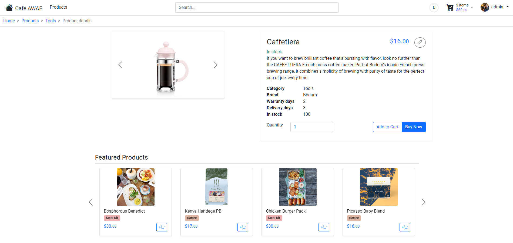

## Introduction
COMP3900 group capstone project.

## Setup
1. Clone repository.
2. Download [python 3.6.8](https://www.python.org/downloads/release/python-368/)
3. Setup virtual environment: `py -3.6.8 -m venv venv`
4. Activate virtual environment: `source ./venv/Scripts/activate`
5. Install requirements: `pip install -r requirements.txt`
6. Run flask server: `cd flask_project && python ./run.py`
7. Open url: `127.0.0.1:5002`

## Gallery

## Notes
Please refer to section 2 of our [report](<./docs/COMP3900 Project Proposal.pdf>) to learn how to use our website's functionalities.